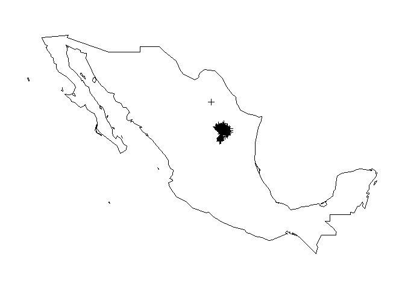
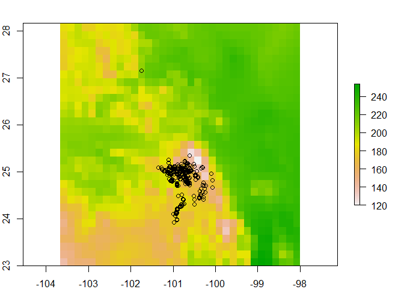
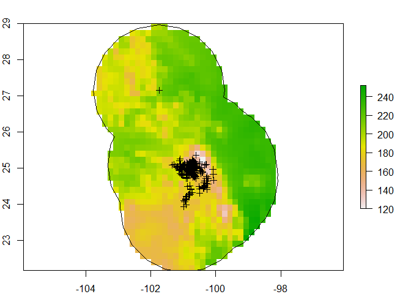
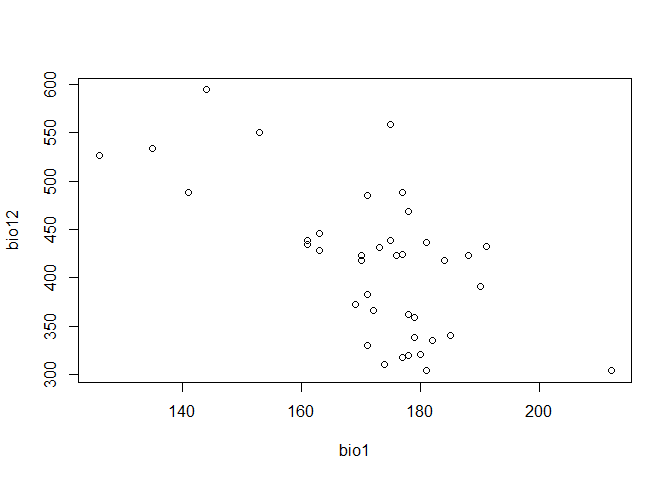
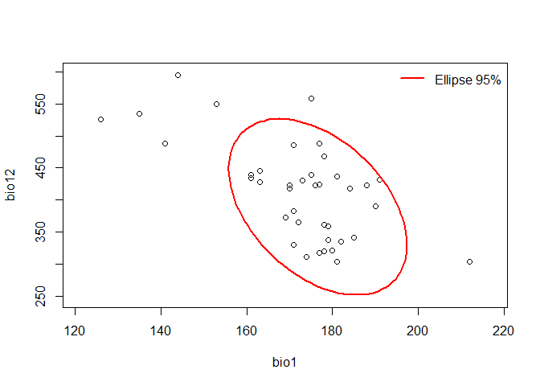
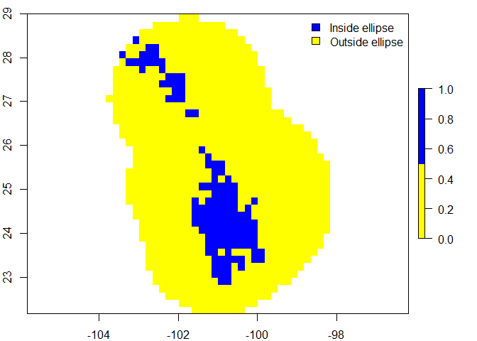

Marlon\_E\_Cobos\_Test
================
Marlon E. Cobos
February 23, 2019

Required packages
-----------------

The following packages are required to perform all the analyses.

``` r
# loading packages, if not installed, installing them
pcakages <- c( "rgbif", "maps", "raster", "rgeos", "sp", "ellipse") # list of packages needed
req_packages <- pcakages[!(pcakages %in% installed.packages()[, "Package"])] # checking if the exist
if (length(req_packages) > 0) { # installing if needed
  install.packages(req_packages, dependencies = TRUE)
}
sapply(pcakages, require, character.only = TRUE) # loading
```

Easy test
---------

Write and script to download species occurrences from GBIF and bioclimatic layers from WorldClim and plot them in a map.

``` r
# getting the data from GBIF
species <- name_lookup(query = "Cynomys mexicanus",
                       rank="species", return = "data") # information about the species

# checking which taxon key returns information
for (i in 1:length(species$key)) {
   cat("key", (1:length(species$key))[i], "=",
   occ_count(taxonKey = species$key[i], georeferenced = TRUE), "\n")
}
```

    ## key 1 = 0 
    ## key 2 = 0 
    ## key 3 = 0 
    ## key 4 = 0 
    ## key 5 = 2201 
    ## key 6 = 0 
    ## key 7 = 0

``` r
key <- species$key[5] # using taxon key that returned information

occ <- occ_search(taxonKey = key, return = "data") # getting data using the taxon key

colnames(occ)[1:10] # checking names of columns to select the ones of interest
```

    ##  [1] "name"              "key"               "decimalLatitude"  
    ##  [4] "decimalLongitude"  "issues"            "datasetKey"       
    ##  [7] "publishingOrgKey"  "networkKeys"       "installationKey"  
    ## [10] "publishingCountry"

``` r
# keeping only georeferenced records
occ_g <- occ[!is.na(occ$decimalLatitude) & !is.na(occ$decimalLongitude),
             c("name", "decimalLongitude", "decimalLatitude")]

# checking points
par(mar = rep(0, 4))
map("world", region = "Mexico") # Mexico country line
points(occ_g[, 2:3], pch = 3) # occurrences
```



Getting data from the Worldclim database.

``` r
# download data from WorldClim
wc10min <- getData(name = "worldclim", var = "bio", res = 10)

# checking in points on variable layers
## limits for plot
plot_limx <- range(occ_g[, 2]) + c(-2, 2)
plot_limy <- range(occ_g[, 3]) + c(-1, 1)

## plot
par(mar = rep(2, 4))
plot(wc10min[[1]], xlim = plot_limx, ylim = plot_limy) # one layer
points(occ_g[, 2:3]) # occurrences
```



Medium test
-----------

Reduce the geographic extent of the raster layers to a buffer of 200 km from the occurrences (this will be reduced geographic area). Extract data from two bioclimatic layers using the occurrences and plot the data in a scatterplot. Calculate an ellipsoid using the centroid and covariance matrix of the extracted data and add the ellipsoid on the previous plot.

``` r
# erasing duplicates
occs <- unique(occ_g)

# points to spatial object
WGS84 <- wc10min@crs # geographic projection

occ_sp <- SpatialPointsDataFrame(coords = occs[, 2:3], data = occs,
                                 proj4string = WGS84)

# planar projection
centroid <- gCentroid(occ_sp, byid = FALSE) # centroid of coordinates

## projecting with latitud and longitud in reference to centroid of occurrence points
AEQD <- CRS(paste0("+proj=aeqd +lat_0=", centroid@coords[2], " +lon_0=", centroid@coords[1], 
                  " +x_0=0 +y_0=0 +ellps=WGS84 +datum=WGS84 +units=m +no_defs")) # planar projection

occ_pr <- spTransform(occ_sp, AEQD) # projection

# buffer
dist <- 200000 # distance for buffer in meters

buff_area <- gBuffer(occ_pr, width = dist) # buffer of 200 km

# reprojection to projection of raster layers
buff_arearp <- spTransform(buff_area, WGS84)

# masking bioclimatic layers
wc_masked <- mask(crop(wc10min, buff_arearp), buff_arearp) # cropping and masking layers

# plot for demonstating masking
par(mar = rep(2, 4))
plot(wc_masked[[1]]) # layer
plot(buff_arearp, add = TRUE) # buffer
plot(occ_sp, add = TRUE) # occurrences
```



Extractind data to occurrences and plotting.

``` r
# extracting values
wc_2var <- wc_masked[[c("bio1", "bio12")]] # keeping only anual mean temperature and annual precipitation

val_wc2var <- extract(wc_2var, occs[, 2:3]) # extracting data

# scatterplot
plot(val_wc2var)
```



Adding ellipsoid to previous plot

``` r
# calculate ellipsoid parameters
cent_ellipse <- apply(val_wc2var, 2, mean) # centroid of ellipse

cov_matrix <- cov(val_wc2var) # covariance matrix
  
# adding ellipsoid to plot 
## creating the ellipsoid 
ellipsoid <- ellipse(x = cov_matrix, centre = cent_ellipse, level = 0.95)

## defining plot limits
ranges_x <- rbind(range(ellipsoid[, 1]), range(val_wc2var[, 1]))
xlims <- c(min(ranges_x[, 1]), max(ranges_x[, 2])) + c(-5, 5)

ranges_y <- rbind(range(ellipsoid[, 2]), range(val_wc2var[, 2]))
ylims <- c(min(ranges_y[, 1]), max(ranges_y[, 2])) + c(-5, 5)

## plotting
plot(val_wc2var, xlim = xlims, ylim = ylims) # scatterplot
lines(ellipsoid, col = "red", lwd = 2) # ellipsoid
legend("topright", lty = 1, lwd = 2, col = "red", # legend
       bty = "n", legend = "Ellipse 95%")
```



Hard test
---------

Using environmental data from three bioclimatic layers, identify regions of the reduced geographic area that are inside and outside an ellipse that contains 95% of the data extracted to the species occurrences.

``` r
# raster and data pre-processing
## three rasters
wc_3var <- wc_masked[[c("bio1", "bio12", "bio15")]] # annual mean temperature, annual precipitation, 
                                                    # and precipitation seasonality

## raster layer to matrix of data
wc_3data <- na.omit(values(wc_3var))

## ellipsoid parameters
occ_data <- extract(wc_3var, occs[, 2:3]) # values in occurrences
centroid_el <- apply(occ_data, 2, mean) # ellipsoid centroid
  
covariance_el <- cov(occ_data) # covariance matrix

# Mahalanobis distance
maha <- mahalanobis(x = wc_3data, center = centroid_el, cov = covariance_el)

# detecting what is inside the ellipsoid that contains 95% of the data in the occurrences
d_freedom <- ncol(wc_3data) # degrees of freedom for chi square test
chi_sq <- qchisq(0.95, d_freedom) # chi square test

check <- maha / chi_sq <= 1 # logical vector indicating which values are inside the ellipsoid

inside <- rep(1, nrow(wc_3data)) * check # defining all valuis inside as 1 and all otside as 0

# identifiying which areas are inside the ellipsoid in the reduced area
map_inside <- wc_3var[[1]] # getting only one variable to be used as base layer

map_inside[!is.na(values(map_inside))] <- inside # replacing values in layer

## plot
par(mar = c(2, 2, 1, 1))
plot(map_inside, col = c("yellow", "blue")) # inside outside layer
legend("topright", bty = "n", fill = c("blue", "yellow"), # legend
       legend = c("Inside ellipse", "Outside ellipse"))
```


